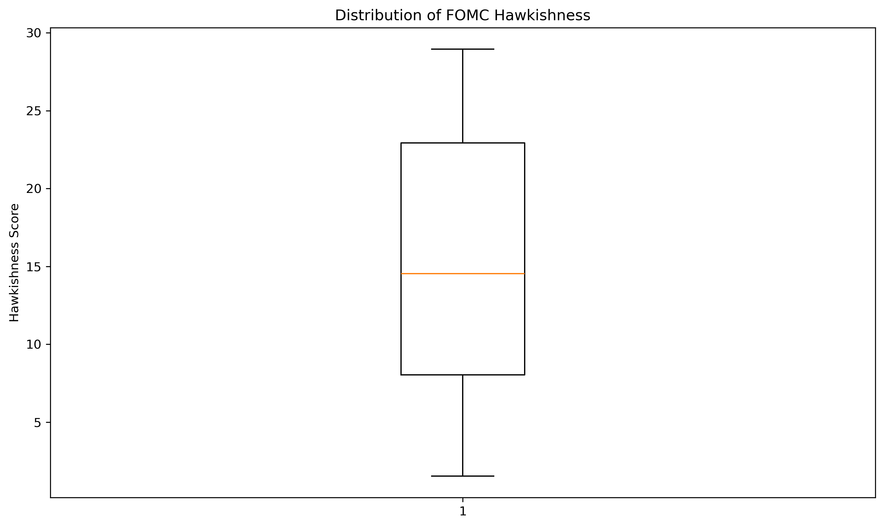
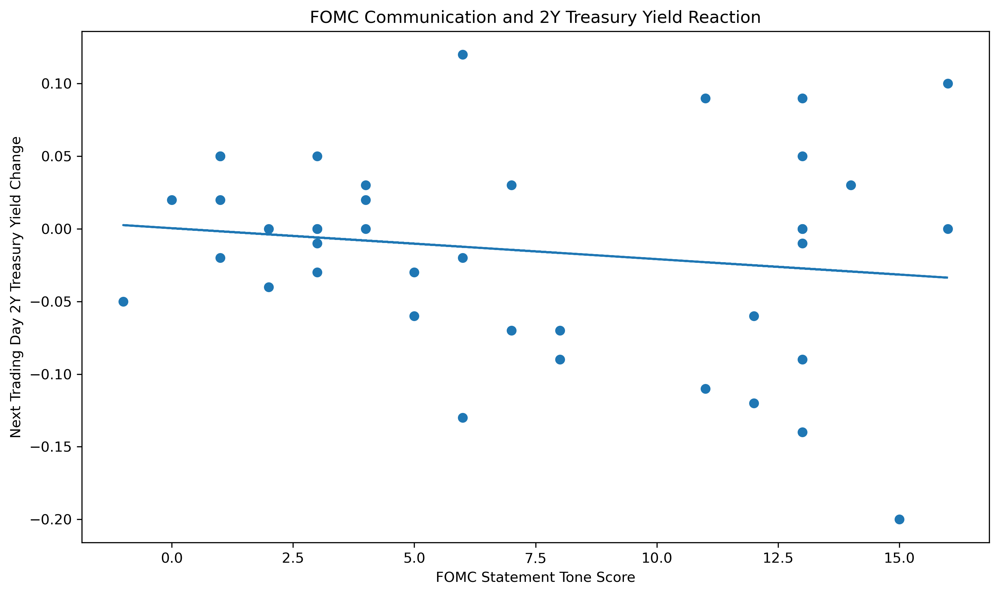
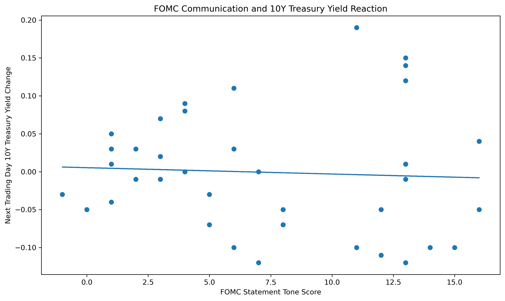
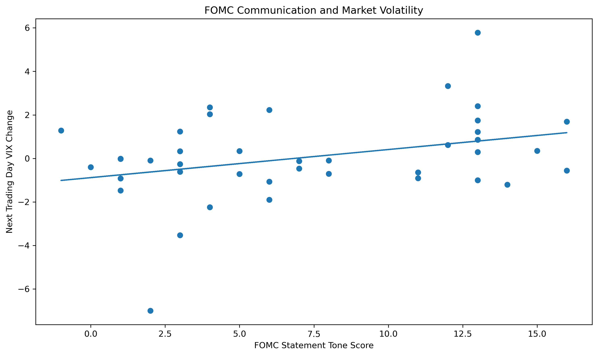

# FOMC Communication and Financial Markets

## Research Question

Does the tone of FOMC statements contain information associated with subsequent movements in Treasury yields and market volatility?

## Overview

This empirical research project examines whether the language used in Federal Open Market Committee (FOMC) statements contains information about financial market reactions around monetary policy announcements.

The analysis combines natural language processing, event study methods, and regression analysis to examine the relationship between unexpected FOMC communication and movements in Treasury yields and market volatility.

The sample contains 40 FOMC statements from January 2021 through December 2024.

## Data

The analysis combines FOMC statement data with financial market data from the Federal Reserve Bank of St. Louis FRED database.

The market variables include:

1. 2 Year Treasury yield
2. 10 Year Treasury yield
3. VIX index
4. Federal Funds Rate

For each FOMC announcement, market reactions are measured using one trading day and two trading day event windows.

## Methodology

### 1. FOMC Statement Processing

FOMC statements are cleaned and processed using Python. Non statement content is removed before constructing the communication measure.

### 2. Hawkishness Measure

A dictionary based hawkishness score is constructed using hawkish and dovish terms in each FOMC statement.

The score is normalized by total statement length.

### 3. Unexpected Communication

To separate communication from the contemporaneous monetary policy decision, hawkishness is regressed on the change in the Federal Funds Rate.

The residual from this regression is interpreted as unexpected FOMC communication.

### 4. Event Study

Market reactions are calculated around FOMC announcement dates.

The main event window compares the last trading day before the announcement with the first trading day after the announcement.

A two trading day window is also examined as a robustness specification.

### 5. Regression Analysis

The main specification estimates the relationship between unexpected FOMC communication and market reactions:

Reaction = α + β UnexpectedTone + ε

All main regression specifications use heteroskedasticity robust HC1 standard errors.

## Main Results

The results show a statistically significant negative association between unexpected FOMC communication and Treasury yield reactions during the announcement day window.

### 2 Year Treasury Yield

Coefficient: −0.00784

P value: 0.030

R squared: 0.128

Observations: 39

### 10 Year Treasury Yield

Coefficient: −0.00679

P value: 0.016

R squared: 0.141

Observations: 39

### VIX

Coefficient: 0.03155

P value: 0.544

R squared: 0.008

The VIX result is not statistically significant.

## Robustness

The analysis includes:

1. Two trading day event windows
2. Cook's distance influence analysis
3. Influence robust specifications
4. Heteroskedasticity robust standard errors

The negative relationship remains statistically significant for the one day Treasury specifications after influential observations are excluded.

The two day analysis provides additional evidence for the 2 Year Treasury yield, while the evidence for the 10 Year Treasury yield becomes weaker after influential observations are excluded.

## Figures

### FOMC Hawkishness Distribution



### 2 Year Treasury Yield Reaction



### 10 Year Treasury Yield Reaction



### VIX Reaction



## Repository Structure

```text
prediction-markets-fed-policy-forecasting/
│
├── data/
│   ├── DFF.csv
│   ├── fomc_dates.csv
│   ├── fomc_dff_decisions.csv
│   ├── fomc_statements_clean.csv
│   ├── market_data_clean.csv
│   └── regression_results.csv
│
├── figures/
│   ├── hawkishness_distribution.png
│   ├── fomc_tone_2y_reaction.png
│   ├── fomc_tone_10y_reaction.png
│   └── fomc_tone_vix_reaction.png
│
├── notebooks/
│   ├── 01_data_exploration.ipynb
│   └── 02_market_data.ipynb
│
├── paper/
│   ├── methodology.md
│   ├── paper.md
│   └── results.md
│
├── src/
│   └── text_features.py
│
└── README.md
